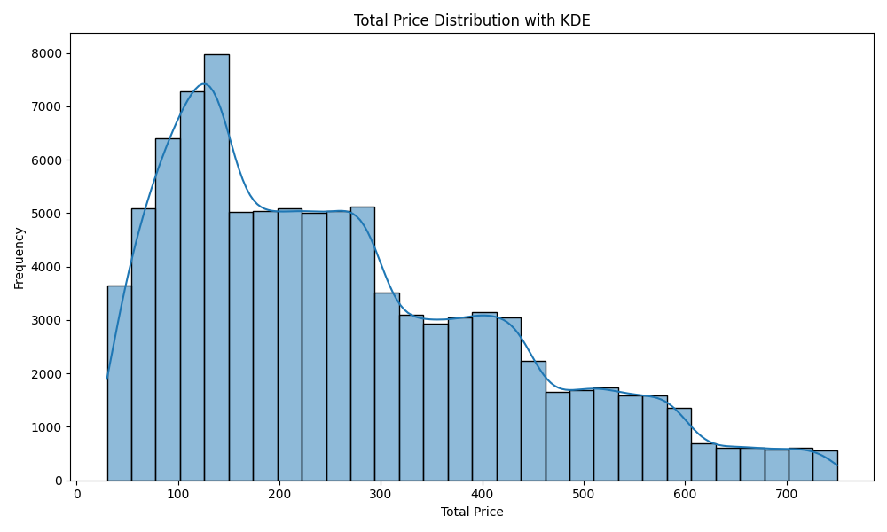
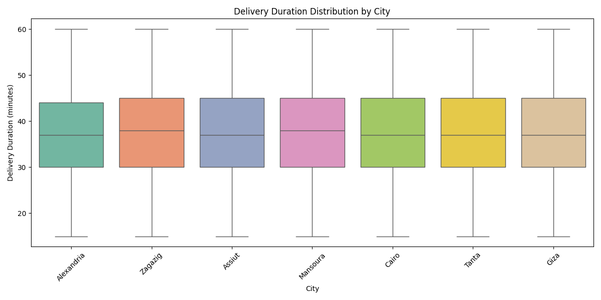
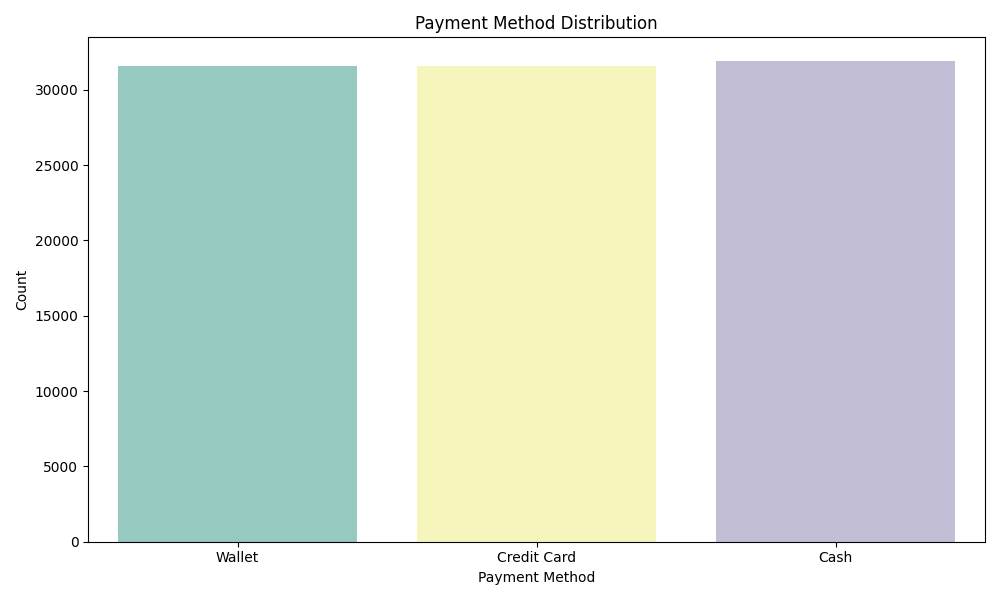
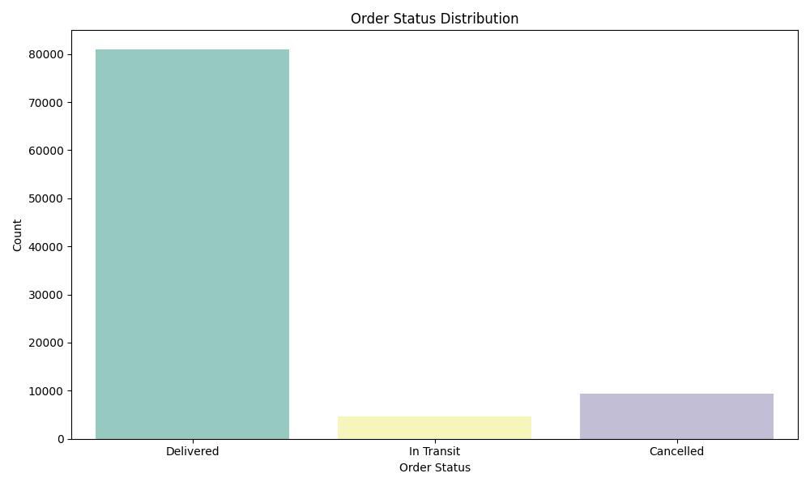

# Food Delivery — ML Capstone Project

An end-to-end machine learning analysis of a food-delivery order dataset covering **100,000 orders** across multiple Egyptian cities. The notebook (`driver.ipynb`) walks through data cleaning, outlier detection, feature engineering, exploratory data analysis (EDA), and predictive models.

---

## 1. Project Overview

| Goal | Predict delivery duration, and driver availability |
|---|---|
| Dataset | `talabat_enhanced_orders.csv` — 100,000 rows, 23 columns |
| Notebook | `driver.ipynb` |
| Models | Logistic Regression, Random Forest Regressor, Random Forest Classifier |

---

## 2. Dataset

**File:** `data/talabat_enhanced_orders.csv`

### Columns (23 total)

| Column | Type | Description |
|---|---|---|
| `Order_ID` | int | Unique order identifier |
| `User_ID` | str | Customer identifier (e.g., `U3522`) |
| `Restaurant_ID` | int | Restaurant identifier |
| `Driver_ID` | int | Driver identifier |
| `Item_Name` | str | Food item ordered (e.g., Koshary, Sushi, Sandwich) |
| `Quantity` | int | Number of items ordered |
| `Total_Price` | float | Order total in local currency (EGP) |
| `Order_Time` | datetime | Timestamp when order was placed |
| `Delivery_Time` | datetime | Timestamp when order was delivered |
| `Delivery_Duration_Minutes` | int | End-to-end delivery time in minutes |
| `City` | str | Delivery city (Alexandria, Cairo, Giza, Assiut, Mansoura, Tanta, Zagazig) |
| `Payment_Method` | str | Cash / Credit Card / Wallet |
| `Order_Status` | str | **Delivered** / Cancelled / In Transit |
| `Driver_Vehicle` | str | Car / Motorbike |
| `Restaurant_Lat/Lon` | float | Restaurant GPS coordinates |
| `Customer_Lat/Lon` | float | Customer GPS coordinates |
| `Driver_Lat/Lon` | float | Driver GPS coordinates at order time |
| `Delivery_Distance_km` | float | Straight-line distance (restaurant → customer) |
| `Traffic_Level` | str | Low / Medium / High |
| `Driver_Availability` | str | **Online** / Offline |

---

### 3. Data Quality

- **Duplicates:** 0 found
- **Missing values:** 0 in any column
- **After outlier removal:** ~95,000 (5% contamination rate)
---

## 4. Pipeline Walkthrough

### Step 1 — Load Data
The CSV is loaded with `pd.read_csv()`. The first five rows confirm the dataset structure: 23 columns spanning order metadata, timestamps, GPS coordinates, and categorical labels.

### Step 2 — Data Cleaning
- **Duplicate removal:** `df.drop_duplicates()` — zero duplicates found, confirming clean sourcing.
- **Missing value handling:** `df.dropna()` — no missing values exist across all 23 columns.
- The dataset is perfectly clean out-of-the-box, which is typical for synthetically generated or pre-curated datasets.

### Step 3 — Outlier Detection (Isolation Forest)
- Applied **Isolation Forest** (`contamination=0.05`, `random_state=42`) on all numeric columns.
- Outliers are flagged and removed, retaining approximately **95,000** records.
- A pairplot colored by outlier label visualizes the separation between normal and anomalous records in numeric feature space.

### Step 4 — Feature Engineering
New features derived from existing columns:

| New Feature | Source | Description |
|---|---|---|
| `Order_Hour` | `Order_Time.dt.hour` | Hour of day the order was placed (0–23) |
| `Order_DayOfWeek` | `Order_Time.dt.dayofweek` | Day of week (0 = Monday, 6 = Sunday) |
| `Delivery_Speed_km_min` | `Distance / Duration` | Estimated delivery speed in km/min |

Categorical columns (`Payment_Method`, `Order_Status`, `Driver_Vehicle`, `City`, `Traffic_Level`, `Driver_Availability`) are one-hot encoded using `pd.get_dummies(drop_first=True)`, expanding the feature set to **28 columns**.

ID and timestamp columns (`Order_ID`, `User_ID`, `Restaurant_ID`, `Driver_ID`, `Item_Name`, `Order_Time`, `Delivery_Time`) are dropped before modeling.

### Step 5 — Exploratory Data Analysis (EDA)
A 2×3 subplot grid visualizes key distributions:

1. **Total Price Distribution** — Histogram showing the price range and frequency of order totals. 

2. **Delivery Duration by City** — Boxplot comparing delivery speed across Egyptian cities.

3. **Payment Method Distribution** — Count of orders by payment type (Cash, Credit Card, Wallet).

5. **Order Status Distribution** — Count of Delivered / Cancelled / In Transit orders (heavily skewed toward *Delivered*).

### Step 6 — Model 1: Order Status Classification (Logistic Regression)
- **Target:** `Order_Status` (Delivered / Cancelled / In Transit)
- **Algorithm:** Logistic Regression (`max_iter=1000`, `lbfgs` solver)
- **Split:** 80% train / 20% test, stratified
- **Metric:** Accuracy

### Step 7 — Model 2: Delivery Duration Regression (Random Forest)
- **Target:** `Delivery_Duration_Minutes`
- **Algorithm:** Random Forest Regressor (`n_estimators=100`)
- **Features:** Order hour, day of week, GPS coordinates, city, traffic level, driver availability, vehicle type, delivery distance
- **Metric:** RMSE (Root Mean Squared Error)

### Step 8 — Model 3: Driver Availability Classification (Random Forest)
- **Target:** `Driver_Availability` (Online=1 / Offline=0)
- **Algorithm:** Random Forest Classifier (`n_estimators=100`)
- **Features:** Same feature set as the regression model
- **Metric:** Accuracy

---

## 6. Key Findings

### ⚠️ Model 1 — Order Status: Misleading Accuracy

| Metric | Value |
|---|---|
| Accuracy | **85.2%** |
| Precision (Cancelled) | 0.00 |
| Recall (Cancelled) | 0.00 |
| Precision (In Transit) | 0.00 |
| Recall (In Transit) | 0.00 |

### ⚠️ Model 2 — Delivery Duration:

Error Rate is 10.15 , after hyperparameter tunning 

Best Parameters {'n_estimators': 100, 'min_samples_split': 2, 'min_samples_leaf': 4, 'max_features': 'log2', 'max_depth': 10} 
Best CV RMSE -9.920 minutes 

### ⚠️ Model 3 — Driver Availability:

Baseline Accuracy: 1.000
Classification Report
 | | precision | recall | f1-score | support |
 |---|---|---|---|---|
 |Offline|1.00|1.00|1.00|1871|
 |Online|1.00|1.00|1.00|17129|
 |accuracy|||1.00|19000|
 |macro avg|1.00|1.00|1.00|19000|
 |weighted avg|1.00|1.00|1.00|19000|

After hyperparameter tunning
Fitting 3 folds for each of 15 candidates, totalling 45 fits
RandomizedSearchCV completed in 7.2 seconds
Best Parameters {'n_estimators': 200, 'min_samples_split': 2, 'min_samples_leaf': 4, 'max_features': 'log2', 'max_depth': 30, 'class_weight': 'balanced'} 
Best CV F1-SCORE 1.0000 